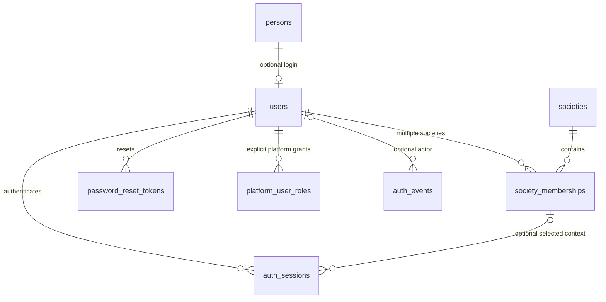

# Step 3 additive schema extension

Migration 006 adds five global identity/security infrastructure tables and two immutable audit triggers. Migration 007 adds an account-change trigger which revokes sessions and consumes outstanding reset links when an account is disabled or its password hash changes, including changes made by a privileged operator. Files 001–005 are unchanged. These tables are not tenant-owned business rows: a login/reset exists independently of society and a user can belong to several societies. auth_sessions.society_id is a nullable server-managed selection, with a composite membership FK preventing selection for another user's nonexistent membership.

| Table                 | Columns and invariants                                                                                                                                                                                                                                                                           |
| --------------------- | ------------------------------------------------------------------------------------------------------------------------------------------------------------------------------------------------------------------------------------------------------------------------------------------------ |
| auth_sessions         | token_hash BINARY(32) PK; nullable user_id/society_id; UTC created_at/idle_expires_at/absolute_expires_at/revoked_at. Index user/revoked and absolute expiry. Idle > created and <= absolute; selected society requires user. RESTRICT FKs to user, society and (society_id,user_id) membership. |
| password_reset_tokens | token_hash BINARY(32) PK; user_id required; UTC created_at/expires_at/consumed_at. Index user/consumed and expiry. Expiry > created, consumption >= created. RESTRICT user FK.                                                                                                                   |
| platform_user_roles   | PK(user_id,role_code); only PLATFORM_ADMIN; granted_at UTC. RESTRICT user FK. Revocation removes this nonhistorical grant; security audits remain immutable.                                                                                                                                     |
| auth_rate_limits      | bucket_hash BINARY(32) PK; attempts unsigned positive integer; expires_at UTC indexed. HMAC obscures raw account/IP/token identity. Fixed-window keys are atomically incremented. Expired buckets are disposable operational state.                                                              |
| auth_events           | BIGINT id PK; nullable user_id RESTRICT FK; allowlisted action; request_id CHAR(36); ip_hash BINARY(32); UTC created_at. User/time and time indexes. No arbitrary payload. BEFORE UPDATE/DELETE triggers reject mutation; no runtime read/update/delete privilege.                               |

No money/financial table changes, cascading deletion or DDL alteration. Session/reset operational rows may be removed after expiry under the bounded maintenance policy; identity and audit parents remain restrictive. Server SQL always uses UTC; browser displays dates in local time when relevant.

Safe rollout: back up and review schema/history, stop incompatible old application writers, apply 006–007 with the dedicated migrator, grant restricted runtime privileges, deploy backend and Angular under the same HTTPS origin, and verify login/logout/reset/membership denial. Validate `db:status` and rerun `db:migrate` (zero pending). Additive migration has no automatic down: roll back app code while retaining these tables/audits. Any later table removal needs operator review and preservation of security history.

The schema contract test explicitly exempts these five global tables from mandatory nonnull tenant ownership and continues checking every existing tenant resource and composite relationship. The selected-session membership FK is additionally enforced by MySQL.
