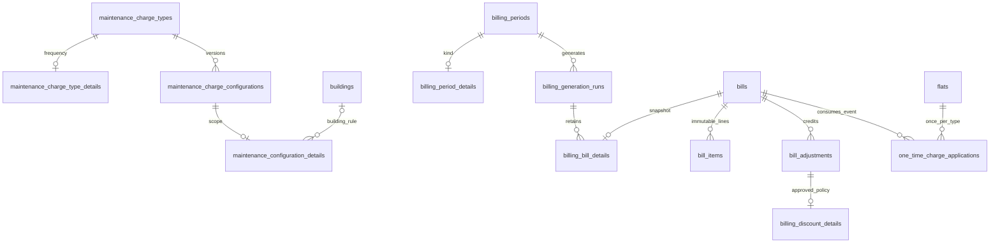

# Step 7 additive billing schema

Migration 012 adds seven tenant tables. Each has `id BIGINT UNSIGNED`, required `society_id`, UTC `created_at`, unique `(society_id,id)` and a restrictive society FK. All resource/actor foreign keys are composite tenant keys. No existing schema/data is rewritten.

| Table                             | New fields and purpose                                                                                                                                | Important constraints/indexes                                                                                                                                                  |
| --------------------------------- | ----------------------------------------------------------------------------------------------------------------------------------------------------- | ------------------------------------------------------------------------------------------------------------------------------------------------------------------------------ |
| maintenance_charge_type_details   | charge_type_id; immutable frequency MONTHLY/ONE_TIME; created_by_membership_id                                                                        | Unique society/type; tenant type and creator FKs                                                                                                                               |
| maintenance_configuration_details | configuration_id; scope SOCIETY/BUILDING/FLAT; optional building_id; eligibility ALL_FLATS/OCCUPIED_ONLY; enabled Boolean; created_by_membership_id   | Unique society/config; tenant building/config/creator FKs; building scope requires building ID and other scopes forbid it; insert trigger verifies baseline flat target agrees |
| billing_period_details            | period_id; MONTHLY/ONE_TIME kind; created_by_membership_id                                                                                            | Unique society/period; tenant period/creator FKs; API requires full calendar month or one day                                                                                  |
| billing_generation_runs           | period_id; idempotency_key ASCII80; request_hash/preview_hash BINARY32; recorded_by_membership_id; STARTED/COMPLETED status; bill_count; completed_at | Unique society/key; society/period index; identity/hash fields immutable; only STARTED→COMPLETED allowed; maximum 50 bills                                                     |
| billing_bill_details              | bill_id; run_id; flat_id; building_code; flat_number; period_code; starts_on/ends_on/due_on; previous_outstanding DECIMAL(12,2)                       | Unique society/bill; society/run index; composite bill/flat FK; immutable issue-time labels/dates and informational debt snapshot                                              |
| billing_discount_details          | adjustment_id; FIXED/PERCENT kind; value DECIMAL(12,2); gross_basis DECIMAL(12,2)                                                                     | Unique society/adjustment; positive basis/value; percentage at most 100; underlying CREDIT adjustment holds actual amount, reason and actor                                    |
| one_time_charge_applications      | charge_type_id; configuration_id; flat_id; bill_id                                                                                                    | Unique society/type/flat across all periods and versions; composite tenant bill/flat FK; immutable event consumption                                                           |

Twenty new triggers enforce metadata immutability, configuration/period append-only behavior, generation completion, configuration target consistency and gross/item/credit consistency at issue. Existing issued-bill/item/adjustment/payment/audit guards remain. No financial or audit cascade deletion is introduced. Immutable versions supplement baseline tenant/version uniqueness. API transactions hold the society lock and recheck canonical preview hashes; DB uniqueness remains the final race defense.

Applied migrations 001–011 retain their original checksums. Legacy configurations/periods get documented defaults through read-time joins, with no speculative historical backfill. See [billing policy/API](../billing/STEP_7_BILLING.md) and [security boundaries](../security/BILLING.md).
