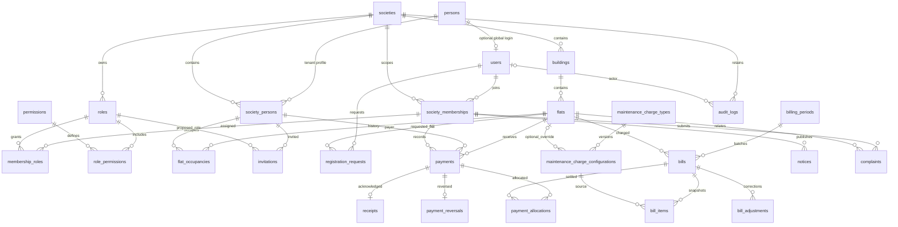

# Database architecture

The [Step 3 auth schema extension](AUTH_SCHEMA.md) adds sessions, reset tokens, explicit platform grants and global security infrastructure to this preserved domain ERD.

One MySQL 8.4 schema, modular monolith, no ORM. InnoDB and utf8mb4_0900_as_ci are explicit for all domain tables. The initial 27 tables support 1–5 pilots without separate databases or infrastructure per society.

All arrows between tenant tables are implemented with composite `(society_id, resource_id)` foreign keys. The diagram omits some society/actor edges for readability; SQL and the dictionary are exhaustive.

## Identity and justified supporting tables

- `persons` is a global opaque identity anchor with no contact data. `users` adds an optional global login, one per Person and normalized email. A Person may have no User. The account email is an authentication identifier, not a tenant directory profile.
- `society_persons` is a required bridge and private resident profile per society: name/contact details and archive state. Occupancy, payment payer and invitations reference `(society_id, person_id)` on this bridge, preventing a tenant from attaching arbitrary global Persons. Linking the same Person across societies requires verified identity/consent; never match residents by name or contact text automatically.
- Membership stores `user_id` once; the Person is obtained through User. It does not duplicate `person_id`. Onboarding must ensure an active membership's Person has a society profile in the same transaction. This cross-table join invariant is a future service responsibility, rather than a redundant identity column.
- `membership_roles` supports multiple roles per membership; `role_permissions` shares a global permission catalog with tenant-owned role grants. There is no automatically privileged global Platform Admin role in this baseline.
- `bill_adjustments` and `payment_reversals` preserve completed records. Reversal is full-payment only in this baseline. Partial refunds/reallocation need a reviewed additive schema in the later financial step.
- `payment_allocations.flat_id` intentionally repeats the flat key to enforce both payment and bill refer to the **same tenant and flat** through composite foreign keys. Financial line descriptions/rates/amounts are immutable snapshots, not copied identity profiles.
- `_schema_migrations` is operational metadata, not tenant/business data.

## Lifecycle and time

Societies: DRAFT → SETUP_IN_PROGRESS → PENDING_VERIFICATION → ACTIVE; SUSPENDED and DEACTIVATED are explicit states. CHECK constraints validate allowed values; authorization and legal transitions will be enforced by future services and audited.

All instants are UTC `DATETIME(6)`; session time zone must be `+00:00`. Do not append `Z` to an unconverted local time. API serialization will use ISO-8601 UTC; Angular will display the society's validated IANA timezone. Occupancy/charge/billing/payment `DATE` columns represent local calendar dates, so do not timezone-shift them. Date ranges are inclusive; a next occupancy interval starts on the following date if intervals must not overlap.

No cascade deletes. Archive resident profiles, buildings/flats, roles/charges and societies; suspend/deactivate accounts and memberships. See [migration policy](MIGRATION_PLAN.md) for financial retention and privacy decisions.

Step 4 adds initial committee onboarding without changing the baseline. See [additive onboarding schema](ONBOARDING_SCHEMA.md) and [API, privacy and verification gates](../security/SOCIETY_ONBOARDING.md).
