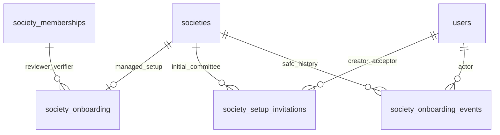

# Additive onboarding schema (008)

Original migrations 001–007 and all identity/financial relationships remain unchanged. Eight additive statements create three tables and five triggers. All foreign keys use RESTRICT; no DROP, ALTER, destructive down command or automatic legacy-data backfill exists.

| Table                     | Fields and constraints                                                                                                                                                                                                                                                                                                                                                      |
| ------------------------- | --------------------------------------------------------------------------------------------------------------------------------------------------------------------------------------------------------------------------------------------------------------------------------------------------------------------------------------------------------------------------- |
| society_onboarding        | id BIGINT; society_id unique/FK; revision BIGINT; residents_confirmed/maintenance_confirmed checked booleans; reviewed_revision, reviewed_by_membership_id, reviewed_at paired; verified_by_membership_id/verified_at paired. Reviewer/verifier use composite society/membership FKs. Verified records require a review of the same revision. UTC instants use DATETIME(6). |
| society_setup_invitations | Tenant id; normalized email/display_name; unique token_hash BINARY(32), status PENDING/ACCEPTED/EXPIRED/REVOKED; delivery_status QUEUED/SENT/FAILED; expires_at, creator user/time; accepted user/time pairing. Generated pending marker provides one pending invitation per society. No pre-proof Person/User identity is duplicated here.                                 |
| society_onboarding_events | Tenant id; actor global user FK; allowlisted safe action; from/to lifecycle states; revision; request_id; UTC created_at. Contains no resident name, charge rate, invitation token or arbitrary request body.                                                                                                                                                               |

Inspect the migration for exact indexes, lengths and named checks. Scope uniqueness and lookup indexes cover society IDs, invitation status/expiry and descending-safe-history reads. Financial DECIMAL columns continue to come from migration 003; initial configuration writes reuse them.

Triggers prohibit event UPDATE/DELETE, onboarding DELETE and changes to completed verifier/review/revision/confirmation fields. A society UPDATE trigger enforces lifecycle transitions and activation gates only for societies with an onboarding record. Legacy societies retain their existing behavior. Application-level committee-role/permission, area and complete criteria remain additional mandatory gates; the DB lifecycle trigger does not substitute for authorization.

Reissue revokes an unexpired pending invitation or marks an elapsed one EXPIRED. Expired PENDING rows are unusable even before reissue updates their stored status; API inspection/acceptance always compare expiry. Accepted identity/proof and lifecycle/audit evidence are retained. Onboarding deactivation preserves all linked records.

See [API/security and rollout](../security/SOCIETY_ONBOARDING.md), [migration plan](MIGRATION_PLAN.md) and [baseline ERD](ERD.md). Future removals or retention/anonymization require a separate reviewed migration.
