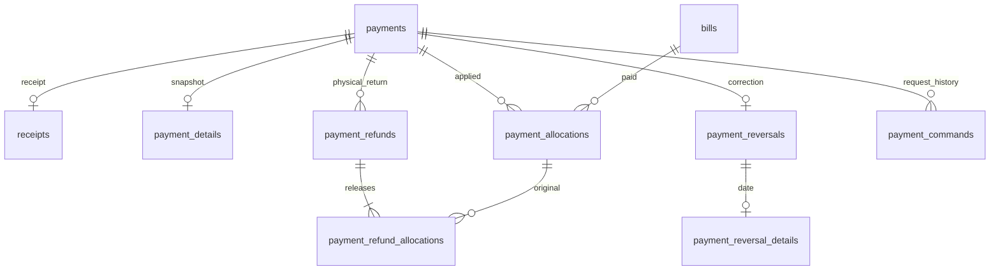

# Additive payment schema (013)

Baseline payments/payment_allocations/payment_reversals/receipts remain unchanged with DECIMAL(12,2), composite tenant/flat/actor foreign keys and immutable history. Migration 013 adds five tenant tables, each with required society_id, unsigned id, unique (society_id,id), restrictive society/resource FKs and UTC created_at.

| Table                      | Purpose                                                                                                                                    | Constraints/indexes                                                                                                                                                                                                                        |
| -------------------------- | ------------------------------------------------------------------------------------------------------------------------------------------ | ------------------------------------------------------------------------------------------------------------------------------------------------------------------------------------------------------------------------------------------ |
| payment_details            | Payment/receipt IDs and immutable society/currency/building/flat/payer/collector/recorder label snapshot                                   | Unique society/payment and society/receipt; insert seal checks receipt belongs to payment and allocations sum to original amount                                                                                                           |
| payment_refunds            | Original payment, DECIMAL(12,2) amount, refund_date, method, reference, reason, recorder membership                                        | Positive amount/four-method checks; unique society/id/payment for child FK; society/date and society/payment indexes; insert locks original and checks no reversal/total refund ceiling                                                    |
| payment_refund_allocations | Refund/payment/original allocation/bill/flat and DECIMAL(12,2) released amount                                                             | Tenant refund/payment triple, original allocation pair, payment/flat and bill/flat FKs; unique refund/allocation; bill/original-allocation indexes; insert checks original relationship, per-allocation/header ceilings and sealed command |
| payment_reversal_details   | Reversal operation local calendar date                                                                                                     | Unique society/reversal; society/date index; baseline reversal retains reason/actor/idempotency                                                                                                                                            |
| payment_commands           | Immutable canonical request hash, key, kind RECORD/REFUND/REVERSE/CORRECT, original payment and applicable refund/reversal/replacement IDs | Unique society/key/refund/reversal/replacement; kind/nullable-field checks; tenant relationships; insert validates completed payment, matching reversal/date or exact refund total                                                         |

Ten update/delete guards make all new tables append-only. Six insert guards supplement baseline immutability: receipt snapshot seal, no late/oversized allocations on sealed/reversed payments, refund totals, original refund allocation boundaries, no reversing refunded payments and command completion. The allocation guard lets invalid tenant/flat relationships reach their restrictive composite FKs, preserving the existing rejection behavior. Existing completed records are not retroactively sealed or given synthetic snapshots.

Application services enforce bill outstanding, active authorized collector, live tenant permissions, dates, references and allocation limits while holding the society lock. Cross-row outstanding has no writable cached total: query DECIMAL aggregates subtract refunds from nonreversed allocation sums. Money authority uses BigInt minor units. DB inserts remain transactional; command completion and immutable audit are in the same transaction. Runtime credentials cannot update/delete finance history; direct DBA writes must honor the documented lock/completion protocol. No parent deletion cascades are introduced.

See [policies/API/rollout](../billing/STEP_8_PAYMENTS.md) and [security](../security/PAYMENTS.md).
