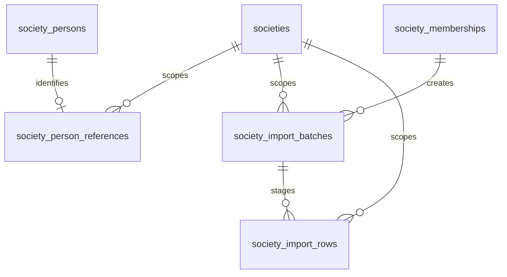

# Step 5 additive schema and migration 009

Migrations 001–008 remain unchanged. 009 adds three tenant tables and four triggers. Existing identities, directories, occupancies, financial records and verification data are preserved.

| Table                     | Columns / relationship                                                                                                                                                                  | Constraints and indexes                                                                                                                                                                                                                                             |
| ------------------------- | --------------------------------------------------------------------------------------------------------------------------------------------------------------------------------------- | ------------------------------------------------------------------------------------------------------------------------------------------------------------------------------------------------------------------------------------------------------------------- |
| society_person_references | id, society_id, person_id, reference_code, created_at UTC                                                                                                                               | FK society and composite tenant/person profile; unique tenant/reference, tenant/person and tenant/id; uppercase trimmed ASCII 3–64                                                                                                                                  |
| society_import_batches    | id, society_id, created_by_membership_id, import_type, status, source_hash, validation_hash, total_rows, error_rows, warning_rows, expires_at, confirmed_at, result_summary, created_at | Composite tenant/creator membership FK; unique tenant/id; owner list and status/expiry indexes; types FLATS/RESIDENTS, states REVIEW/CONFIRMED/CANCELLED/EXPIRED; 1–500 rows, bounded error/warning counts; expiry after creation; confirmed timestamp/summary pair |
| society_import_rows       | id, society_id, batch_id, csv_row_number, line_number, row_data, validation_errors, validation_warnings                                                                                 | Composite tenant/batch FK; unique tenant/batch/row and tenant/id; row 2–501, physical line >= logical row; nullable JSON permits personal-data minimization                                                                                                         |

References avoid storing redundant user IDs on profiles/occupancies. The creator membership determines the audit actor through authenticated identity; import rows store resolved tenant targets for review binding, not denormalized permanent identities. SHA-256 hashes are BINARY(32); API exposes hex. Source hash is a canonical fingerprint of CSV content; validation hash includes decisions and resolved IDs and survives MySQL JSON key reordering.

Triggers confirmed_import_immutable and import_batch_no_delete retain completed evidence. occupancy_history_close_only permits only open→closed with all identity/start attributes preserved; occupancy_history_no_delete retains occupancy history. Existing DATE checks reject reversed ranges, unique open occupancy keys supplement service overlap checks, and all foreign keys remain restrictive. Existing DECIMAL(12,2) financial columns are untouched; flat area remains DECIMAL(10,2).

Run npm run db:validate, inspect npm run db:status, then npm run db:migrate with separate schema-scoped migrator credentials. Refresh narrow runtime grants in src/database/property-grants.ts through an administrative deployment step; never grant the runtime migration/DELETE/finance privileges. Use an isolated empty livora_test_ schema for tests and reviewed development fixtures only. MySQL DDL is not transactional: a partial failure is retained and requires operator inspection. Do not retry blindly, edit an applied migration or drop tables/data. Roll back application deployment by disabling the new routes and retaining additive tables/triggers; no destructive down migration is supplied. Old Step 4 insertion paths remain compatible; the new occupancy history restrictions also protect previous records.

Tenant reads/writes derive the selected society from the stored session, recheck active membership/profile and scope every resource SQL predicate. Review access additionally requires the creating membership. System expiry reads batch tenant IDs only and scopes each subsequent transaction and audit. See [API, deletion rules, UTC/calendar interpretation and import controls](../security/PROPERTY_MANAGEMENT.md).
