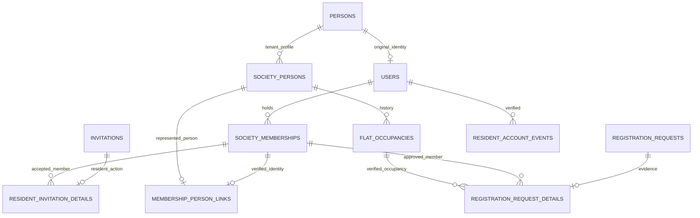

# Resident access schema — Step 6

Migrations 010–011 add tables and guards only. They do not alter, replace, backfill, delete or merge existing records. All referenced financial/audit/occupancy history remains intact. Default foreign-key behavior is RESTRICT; there are no cascading deletions.

| Table                          | Purpose and constraints                                                                                                                                                                                                                                                                                                      |
| ------------------------------ | ---------------------------------------------------------------------------------------------------------------------------------------------------------------------------------------------------------------------------------------------------------------------------------------------------------------------------- |
| membership_person_links        | Verified membership-to-tenant-Person association. Unique society/membership and society/person; composite FKs to membership and profile; immutable update/delete guards. Legacy fallback is users.person_id.                                                                                                                 |
| resident_invitation_details    | One detail per society/invitation. Fixed RESIDENT_JOIN action, QUEUED/SENT/FAILED delivery, accepted membership composite FK. Raw tokens remain absent; the baseline invitations table stores the digest and states.                                                                                                         |
| registration_request_details   | One detail per society/request. Applicant name/phone/note, resolved Person, approved membership and occupancy composite FKs. All resolved identifiers are null or all populated. Applicant evidence and completed resolution cannot be overwritten. Baseline registration_requests stores reviewer/time/decision and states. |
| resident_account_verifications | Global, short-lived email verification challenges. SHA-256 token primary key; Argon2id password hash; 30-minute expiry; consumption timestamp; email/name/hash scrubbed at expiry/consumption. Indexed email and expiry; no society access relationship.                                                                     |
| resident_account_events        | Global append-only ACCOUNT_VERIFIED evidence. User FK, request correlation, keyed IP digest and UTC creation time. Separate from the unchanged earlier auth_events vocabulary. Runtime can insert only.                                                                                                                      |

Every tenant table has a non-null society FK, a unique society/id resource key and tenant-composite relationships. BIGINT values remain strings in API code. UTC DATETIME(6) is used for instants; occupancy DATE values retain society-local calendar semantics.

The explicit identity link is justified by imported/account-free people and pre-existing global accounts. It preserves the original Person ID in occupancy/financial history rather than rewriting relationships. Only verified invitation acceptance or attested committee approval creates it. It cannot be used to claim a Person already owned by another global account or bound to another membership in that society. See [the security and API contract](../security/RESIDENT_ACCESS.md).

Invitation guards allow only PENDING → ACCEPTED/EXPIRED/REVOKED; identity, token, expiry and terminal state stay immutable. Acceptance requires the linked tenant membership. Registration guards allow only PENDING → APPROVED/REJECTED/CANCELLED, preserve original claims and require linked person/membership/occupancy for approval. The existing status/time/reviewer checks remain enforced as well.

Rollback is an application rollback after inspecting migration/grant compatibility. Do not drop the new tables or undo verified memberships automatically. MySQL DDL is not transactionally reversible; inspect any partially applied statement and migration history before recovery. Empty isolated tests validate migration serialization, checksums, rerun no-op, tenant FKs, history guards and restricted runtime grants.
